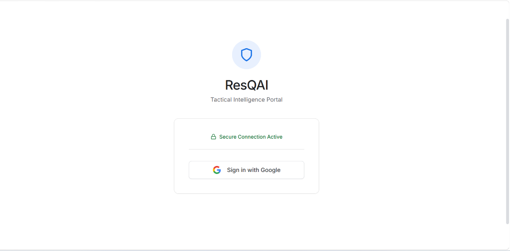
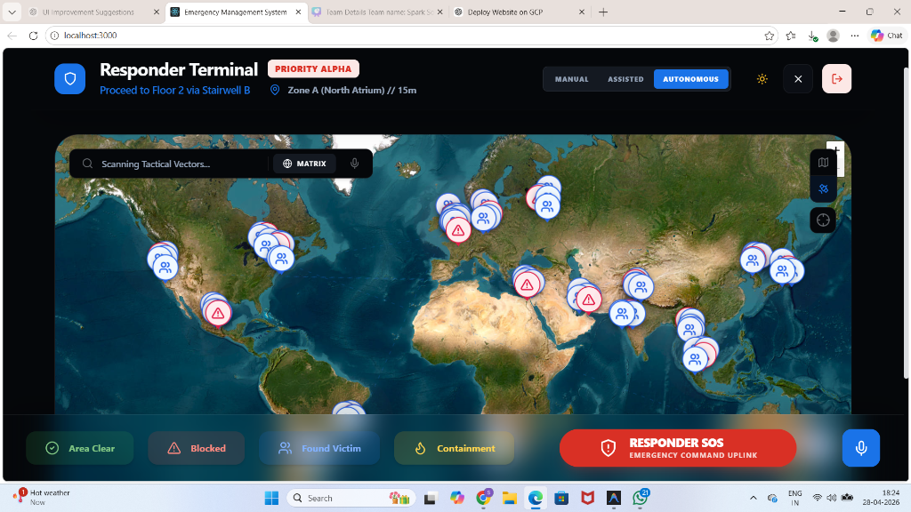
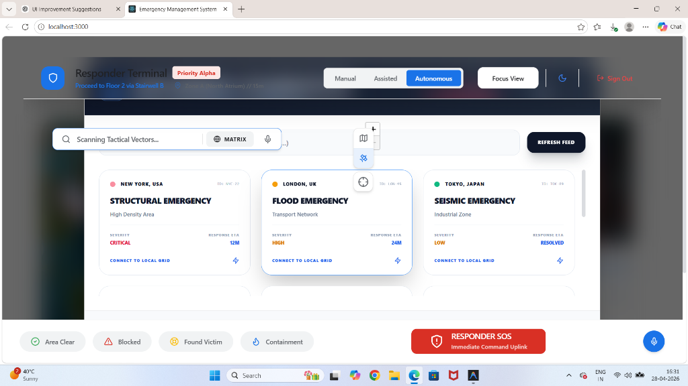

# Emergency Management Frontend

## 📸 Tactical Preview

### 🔐 Secure Access


### 🖥️ Responder Dashboard (Tactical View)


### 🌐 Global Intelligence Matrix


A modern React-based frontend for the Emergency Management System that provides real-time monitoring and response coordination capabilities.

## Features

- **Real-time Emergency Dashboard**: Comprehensive view of emergency events with live updates
- **Event Simulator**: Test various emergency scenarios with preset configurations
- **Interactive UI**: Modern, responsive design using TailwindCSS and Lucide icons
- **API Integration**: Seamless connection to FastAPI backend
- **Performance Metrics**: KPI tracking and response time monitoring

## Technology Stack

- **React 18** with TypeScript
- **TailwindCSS** for styling
- **Lucide React** for icons
- **Axios** for API communication
- **Recharts** for data visualization

## Getting Started

### Prerequisites

- Node.js (v16 or higher)
- npm or yarn
- FastAPI backend running on port 8000

### Installation

1. Clone the repository:
```bash
git clone <repository-url>
cd frontend
```

2. Install dependencies:
```bash
npm install
```

3. Set up environment variables:
```bash
cp .env.example .env
# Edit .env to match your API configuration
```

4. Start the development server:
```bash
npm start
```

The application will be available at `http://localhost:3000`

## Usage

### Event Simulator

Use the event simulator to test different emergency scenarios:

1. **Quick Presets**: Choose from predefined scenarios (Fire Emergency, Crowd Panic, etc.)
2. **Custom Configuration**: Manually set triggers, location, and personnel
3. **Real-time Processing**: See immediate response from the backend system

### Dashboard Features

- **Status Overview**: Critical, Moderate, or Low emergency levels with visual indicators
- **Confidence Score**: AI-powered risk assessment with percentage display
- **Evacuation Routes**: Location-based routing recommendations
- **Personnel Coordination**: Role assignments and team deployment
- **Environmental Data**: Real-time sensor readings (temperature, smoke, gas levels)
- **Communication Channels**: Active notification methods
- **Timeline View**: Sequential event tracking
- **KPI Metrics**: Response time and performance indicators

## API Integration

The frontend connects to the FastAPI backend using the following endpoints:

- `GET /` - Health check
- `POST /process` - Process emergency events

## Configuration

### Environment Variables

- `REACT_APP_API_URL`: Base URL for the API backend (default: http://localhost:8000)

### Styling

The application uses TailwindCSS with custom theme colors:

- `critical`: Red for high-priority alerts
- `moderate`: Amber for medium-priority alerts  
- `low`: Green for low-priority alerts
- `emergency`: Red for emergency actions
- `safe`: Green for safe states

## Development

### Project Structure

```
src/
  components/          # React components
    EmergencyDashboard.tsx  # Main dashboard view
    EventSimulator.tsx      # Event configuration interface
  services/           # API services
    api.ts            # Axios configuration and endpoints
  types/              # TypeScript type definitions
    index.ts          # Emergency event and response types
  App.tsx             # Main application component
  index.css           # Global styles and Tailwind imports
```

### Adding New Features

1. Create new components in the `components/` directory
2. Define TypeScript types in `types/index.ts`
3. Update API services in `services/api.ts`
4. Add routing if needed

## Build and Deployment

### Production Build

```bash
npm run build
```

The build files will be in the `build/` directory.

### Deployment

The application can be deployed to any static hosting service:
- Vercel
- Netlify
- AWS S3 + CloudFront
- GitHub Pages

## Contributing

1. Fork the repository
2. Create a feature branch
3. Make your changes
4. Add tests if applicable
5. Submit a pull request

## License

This project is part of the Emergency Management System. See the main repository for licensing information.

## Support

For issues and questions:
- Check the API documentation
- Verify backend connectivity
- Review browser console for errors
- Ensure environment variables are correctly set
